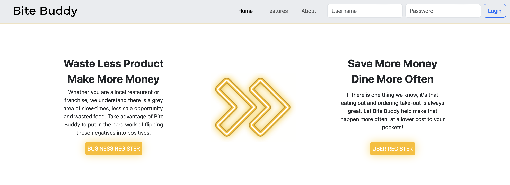
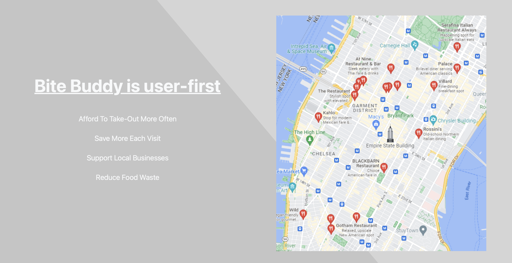
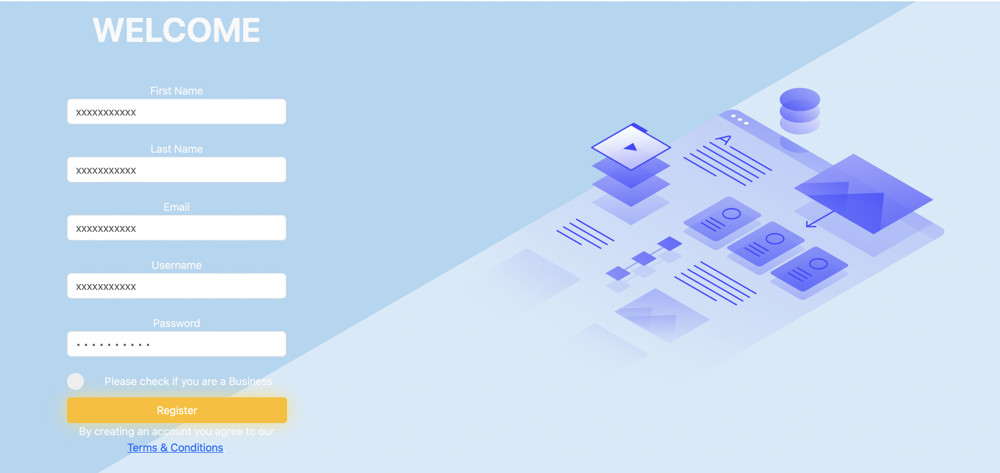
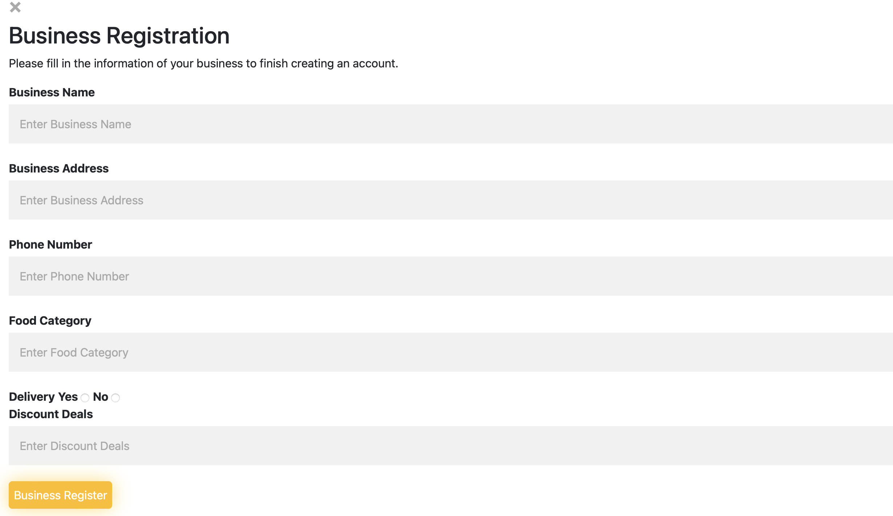

# Bite_Buddy

## Description 

Bite Buddy is a web application that helps users eat out more often at a lower cost, by providing restaurants a platform to offer extended/additional discounts within their slower times of day. Our hope is that users will afford the opportunity to support their local restaurants, and these restaurants will be more inclined to support their local community by offering discounts.

## Installation 

- Sequelize 
- Express
- Axios
- Node

## Technologies Used 

- Visual Studio Code
- HTML
- CSS
- JavaScript
- Handlebars
- Sequelize 
- Nodemon
- Express
- Axios

## Application Images

## Usage

Users will be able to open the application to the home page and see a navigation bar that allows them to login via a username and password. They will see a preview of how the application works and testimonials/reviews on the bottom of our application. The home page will also feature two buttons; one for the user and the other for restaurants. On the registration page they will be able to register with a first and last name, an email, a username, and a password. And if they are a restaurant owner they will be prompted to answer more questions such as: business name, business address, phone number, food category, delivery, and discount details. On the application page users will see a map on the right side and on the left side be able to search restaurants in the area code of their choosing and save their favorite restaurants.

## Credits

- B. Zachary
- G. Kimberlie
- Z. Nick
- J. Solomon

## Websites

- [Github](https://github.com/Animeet/Bite_Buddy)
- [Heroku Live Deployed](https://intense-anchorage-81492.herokuapp.com/) 

## License 

Refer to the LICENSE under the Repository
Copyright © B, Zachary. Guillaume, Kimberlie. Zentai, Nick. Jones, Solomon. All rights reserved.
